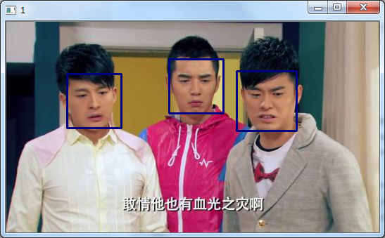

* 收集训练数据
    * 下载[图片源](http://www.cs.columbia.edu/CAVE/databases/pubfig/)
    * 通过三方库来划分出识别区域
    * 学习OpenCv的[视频处理相关Api](http://opencv-python-tutroals.readthedocs.io/en/latest/py_tutorials/py_gui/py_video_display/py_video_display.html?highlight=videocapture)

    * 参考[Face Detection using Haar Cascades](http://opencv-python-tutroals.readthedocs.io/en/latest/py_tutorials/py_objdetect/py_face_detection/py_face_detection.html#face-detection)，完成初版人脸检测功能

        

    * 准确性对比，发现对正面照还好，侧面照不行

        

        

* 模型选择
    * 了解[R-CNN、SPP-NET、Fast-R-CNN、Faster-R-CNN、YOLO、SSD总结](http://blog.csdn.net/eli00001/article/details/52292095)
    
    
    
* 参考文献
    * [R-CNN、SPP-NET、Fast-R-CNN、Faster-R-CNN、YOLO、SSD总结](http://blog.csdn.net/eli00001/article/details/52292095)
    * 