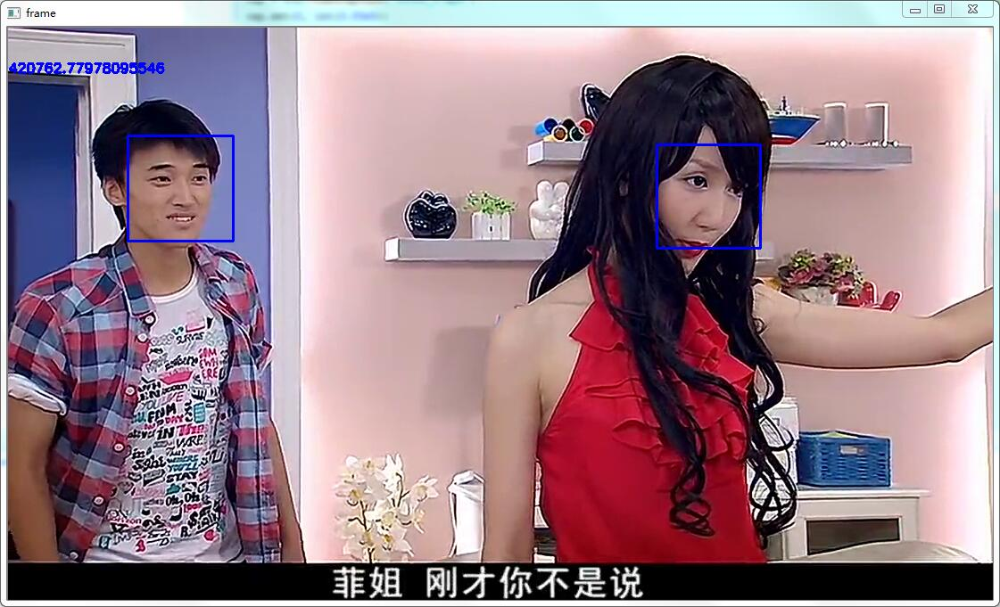

* 学习OpenCv的[视频处理相关Api](http://opencv-python-tutroals.readthedocs.io/en/latest/py_tutorials/py_gui/py_video_display/py_video_display.html?highlight=videocapture)

* 参考[Face Detection using Haar Cascades](http://opencv-python-tutroals.readthedocs.io/en/latest/py_tutorials/py_objdetect/py_face_detection/py_face_detection.html#face-detection)，完成初版人脸检测功能

  

* 准确性对比，发现对正面照还好，侧面照不行

  

  

